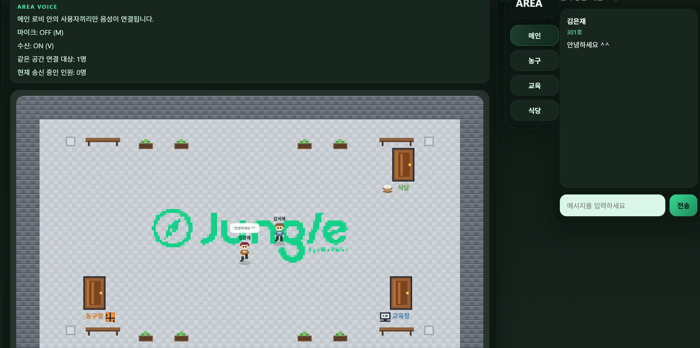
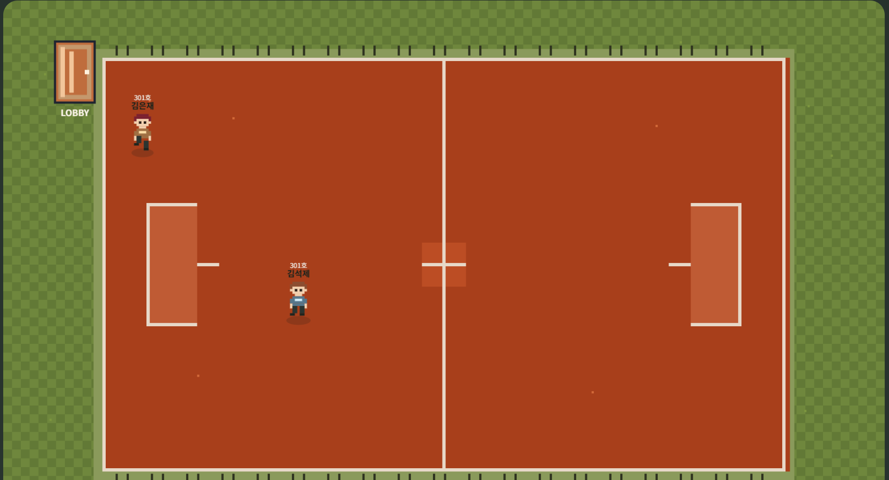
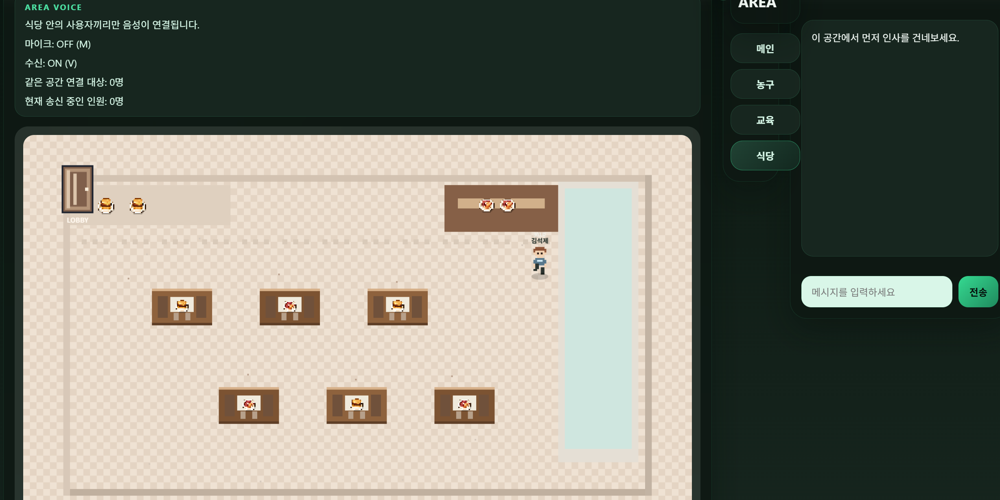
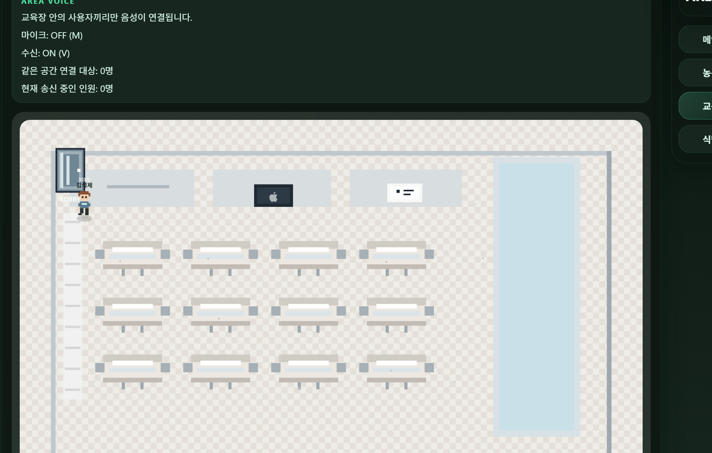

# Cyber Jungle

## 프로젝트 소개

Cyber Jungle은 교육 과정 구성원이 같은 가상 캠퍼스에 접속해 실시간으로 만나고, 대화하고, 파티를 모집할 수 있는 2D 커뮤니티 서비스입니다.

## 서비스 화면

### 로비

메인 진입 공간으로, 사용자가 처음 접속한 뒤 다른 공간으로 이동하기 전에 머무르는 공용 허브입니다.

### 농구 코트

사용자가 이동해서 진입할 수 있는 세부 공간 중 하나로, 로비와 구분된 별도 area 화면입니다.

### 카페테리아

대화와 파티 모집이 가능한 공간으로, 다른 테마의 area가 어떻게 구성되는지 보여주는 예시 화면입니다.

### 강의실

가상 캠퍼스 내 학습 공간 콘셉트를 반영한 area로, 사용자가 공간 단위로 이동하며 상호작용할 수 있음을 보여줍니다.

## 기획 의도
- 정글 내에서 타 교육장, 타 교육과정 사람들과의 소통 부재를 경험
- 가볍게 즐길 수 있는 메타버스 환경에서 소통하는 경험을 통해 커뮤니케이션 활성화를 도모

## 주요 기능

- 사용자 정보를 입력하여 바로 입장할 수 있습니다.
- 같은 공간의 사용자 위치와 움직임이 실시간으로 동기화됩니다.
- 채팅을 통해 다른 사용자와 대화할 수 있습니다.
- 로비를 제외한 공간에서 파티를 만들고, 정해진 인원만큼 참여할 수 있습니다.
- 같은 area에 있는 사용자끼리 음성 연결을 시도할 수 있습니다.

## 기존 버전 대비 개선점

- 단일 맵 기반 구조에서 로비와 세부 공간으로 이동하는 구조로 확장했습니다.
- 단순 채팅 중심 서비스에서 파티 모집과 참여 중심 서비스로 발전시켰습니다.

## 기술 스택

| 구분 | 사용 기술 |
| --- | --- |
| **프론트엔드** | React + Vite |
| **백엔드** | Node.js + Express.js |
| **실시간 통신** | Socket.IO |
| **음성 통신** | WebRTC |
| **렌더링** | HTML Canvas |
| **호스팅** | Vercel (프론트) + Railway (백엔드) |
| **형상 관리** | GitHub |

## 테스트 및 검증

- 사용자 입장 및 위치 동기화 정상 동작 확인
- 같은 area 사용자 감지 성공, 음성 송수신 기능은 미완성
- 파티 최대 인원 제한 정상 동작 확인
